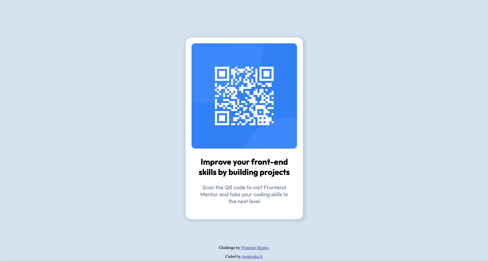

# Frontend Mentor - QR code component solution
This is a solution to the [QR code component challenge on Frontend Mentor](https://www.frontendmentor.io/challenges/qr-code-component-iux_sIO_H). 

## Overview
The goal of this project was to format the image and text provided by the frontendmentor.io using HTML and CSS styling based on the jpg image and Figma design.

### Screenshot

### Links
- Solution URL: https://github.com/agsendo/FEM-case1-qr

## My process
First, I added a separate file for styling, adding some colours and fonts.
Then, I worked on the size of the main image with QR code, as well as margins and padding.
Next, I improved the fonts and text position.
Finally, I set the positions of the main section and footer. The main challange was to center all of the elements, keeping it responsive to the screen size.

### Built with
- HTML
- CSS

## Author
- GitHub - https://github.com/agsendo